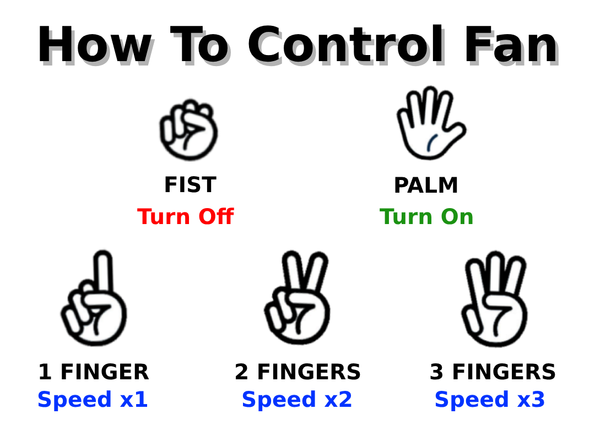

# Touchless Gesture-Controlled Fan Using Ultrasonic Sensor & Hand-Tracking

This project presents the development of a dual-mode gesture-controlled fan utilizing an ultrasonic sensor, Arduino Uno, and Python's OpenCV, offering a hygienic and contactless alternative to conventional fan controls.

---

## ⚙️ Dual-Mode System Operation

The system features two operating modes: **Ultrasonic Mode** (default hardware proximity control) and **Camera Mode** (computer vision hand-tracking).

### 1. Ultrasonic Mode (Proximity Control)
Once the fan is plugged in, it automatically starts in **Ultrasonic Mode** by default. The ultrasonic sensor measures distance and updates the fan speed dynamically on an LCD display:
* **0 to 70 cm:** Speed x3 (255 PWM)
* **70 to 90 cm:** Speed x2 (170 PWM)
* **90 to 100 cm:** Speed x1 (85 PWM)

  

### 2. Camera Mode (Hand-Gesture Control)
Using Python and OpenCV, the system processes hand gestures via a graphical interface that detects connected COM ports and webcams. It tracks a single hand to prevent system confusion and maximize performance.

  

---

## 🖐️ How To Control Fan (Gesture Guide)

  

* **Palm:** Turn On / Default Speed x1
* **Fist:** Turn Off
* **1 Finger:** Speed x1 (85 PWM) *(Any finger can be raised)*
* **2 Fingers:** Speed x2 (170 PWM) *(Any 2 fingers can be raised)*
* **3 Fingers:** Speed x3 (255 PWM) *(Any 3 fingers can be raised)*

> ⌨️ **Keyboard Controls during Camera Mode:**
> * Press **`X`** to temporarily disable or re-enable hand-tracking (prevents unintended inputs when the fan is idling).
> * Press **`Esc`** to exit the camera application.

---

## 🛠️ Hardware Assembly & Wiring Guide

The system integrates an Arduino microcontroller, an IRZ44N MOSFET, a 10k Ohm resistor, jumper wires, an ultrasonic sensor, an LCD display, and a 12V DC cooling fan.

* **MOSFET Setup:** Gate connected to Arduino Pin 4, Source to GND rail, and Drain to fan's GND. A 10KΩ resistor is positioned between Gate and Drain for stable switching.
* **Cooling Fan Power & PWM:** Powered via the 12V adapter/Vin pin, with the signal wire connected to Arduino Pin 3 for PWM speed regulation.
* **LCD Display:** Connected via SDA to Analog A4 and SCL to Analog A5 for I2C communication.
* **Ultrasonic Sensor:** Trig pin connected to Arduino Pin 9 and Echo pin to Pin 10 for distance telemetry.
* **Power Architecture:** Powered via a 12V 1A external adapter or a 5V USB COM port.

---

## 💻 System Setup & Execution

### 1. Hardware Setup (Arduino)
* Open **`Arduino Source Code.ino`** using the Arduino IDE.
* Connect your Arduino Uno hardware to your computer and upload the script.

### 2. Software Setup (Python)
* Install required libraries (OpenCV, MediaPipe, PySerial).
* Run **`Hand-Tracking Code (Run this on Python IDE).py`** in your Python IDE to initialize the graphical user interface, verify the COM port, and launch tracking.

---

## 📂 Repository Structure
* **`Arduino Source Code.ino`** — Microcontroller script for proximity processing, LCD output, and hardware actuation.
* **`Hand-Tracking Code (Run this on Python IDE).py`** — Python computer vision script for GUI and hand gesture recognition.
* **`tutorial.png`** — Reference guide for gesture controls.
* **`image.png`** — System preview asset.
* **`icon.ico`** — Application icon asset.
