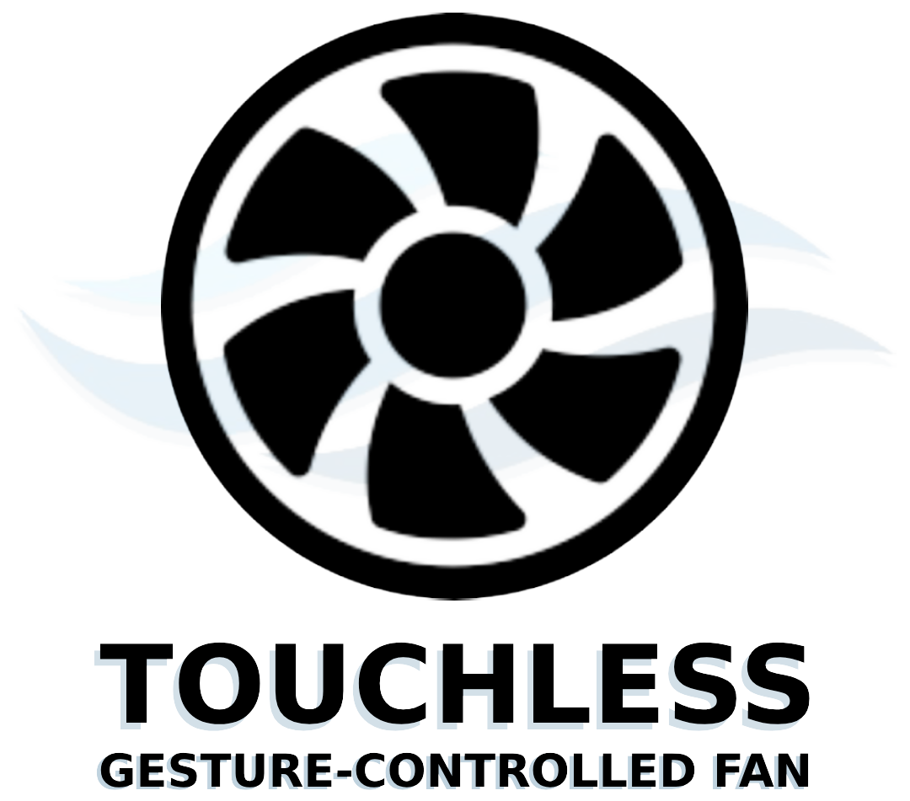

# Touchless Gesture-Controlled Fan Using Ultrasonic Sensor & Hand-Tracking

This project presents the development of a gesture-controlled fan utilizing an ultrasonic sensor, Arduino Uno, and Python's OpenCV by offering a hygienic and contactless alternative to conventional fan controls.

---

## 🖐️ How To Control Fan
The system uses computer vision hand-tracking gestures to control the fan's state and speed levels interactively:

  

* **Fist:** Turn Off
* **Palm:** Turn On
* **1 Finger:** Speed x1
* **2 Fingers:** Speed x2
* **3 Fingers:** Speed x3

---

## 📸 System Overview

  

---

## 🛠️ System Architecture & Setup

To get this project running, you need to configure both the microcontroller hardware and the computer vision script:

### 1. Hardware Setup (Arduino)
* Open **`Arduino Source Code.ino`** using the Arduino IDE.
* Connect your Arduino Uno hardware to your computer.
* Upload the source code to the Arduino board to manage the ultrasonic sensor and fan actuation.

### 2. Software Setup (Python)
* Ensure you have Python installed along with required libraries (OpenCV, MediaPipe, PySerial).
* Run **`Hand-Tracking Code (Run this on Python IDE).py`** on your preferred Python IDE (such as PyCharm or VS Code) to initialize the live hand-tracking interface and communicate with the hardware.

---

## 📂 Repository Structure
* **`Arduino Source Code.ino`** — Microcontroller script for fan hardware control.
* **`Hand-Tracking Code (Run this on Python IDE).py`** — Python computer vision script for hand gesture detection.
* **`tutorial.png`** — Reference guide for gesture controls.
* **`image.png`** — System preview asset.
* **`icon.ico`** — Application icon asset.
